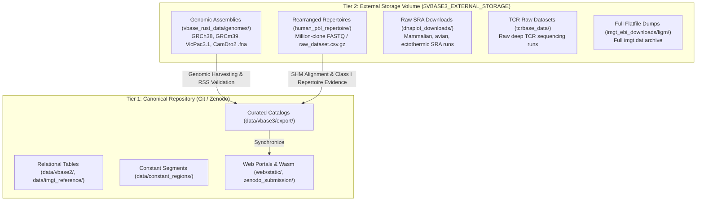

# VBASE3 Data Provenance, Source Directories & Storage Architecture

## 1. Executive Summary & Open Science Principles
The **VBASE3 Immunogenomic Database** provides a verified, comparative, and synthesis-ready reference catalog of vertebrate adaptive immune receptor variable (V), diversity (D), joining (J), and constant (C) segments.

To guarantee complete reproducibility, biological integrity, and academic neutrality:
1. **100% Open Data Provenance**: Every entry in VBASE3 originates strictly from public international nucleotide sequence databases (INSDC: NCBI GenBank, ENA, DDBJ), official IMGT releases, the peer-reviewed VBASE2 relational database, chromosome-level reference genome assemblies, or experimentally solved macromolecular structures (RCSB PDB / AlphaFold DB).
2. **Complete Repository Decoupling**: VBASE3 is a public reference repository. No internal campaign identifiers, proprietary modeling toolnames, or wet-lab project identifiers exist within this repository. Any cross-project validation or benchmarking against private datasets is conducted exclusively from within external project workspaces.
3. **Formal Two-Tier Storage Hierarchy**: Heavy raw sequencing archives and whole-chromosome assembly files reside on external storage media (configured via `$VBASE3_EXTERNAL_STORAGE`), while canonical, curated germline catalogs and client-side WebAssembly distribution artifacts are tracked within the repository.

---

## 2. Directory Architecture & Primary Data Origins

The repository organizes data across structured source directories under `data/` and `zenodo_submission/`:

| Directory Path | Role & Content | Primary Origin / Source Standard | Accession / Reference Standard |
| :--- | :--- | :--- | :--- |
| `data/vbase3/export/` | Public canonical release tables (`vbase3_class1_master_catalog.tsv`, `vbase3_class1_v_heavy.tsv`, `vbase3_class1_v_light.tsv`, `vbase3_d_heavy.tsv`, `vbase3_j_heavy.tsv`, `vbase3_j_light.tsv`, `vbase3_crossreference_table.tsv`). | Curated and validated VBASE3 Class I functional sequences. | INSDC accessions, IMGT gene names, VBASE2 IDs, RefSeq genomic coordinates. |
| `data/vbase3/` | Species-specific confidence JSON indices (`vbase3_species_confidence_index.json`), mammal catalogs (`vbase3_mammal_catalog.json`), ectothermic vertebrate catalogs (`ectothermic/`), and curated species tables. | Harvested and filtered genomic V(D)J scans with verified RSS recombination signals and mature synthesis boundaries. | RefSeq assemblies, NCBI Taxonomy IDs, ENA locus accessions. |
| `data/vbase2/` | Curated public VBASE2 relational tables and legacy ID mapping files (`vbase2_sequences.tsv`, `vbase2_human_mapping.tsv`, `vbase2_mouse_mapping.tsv`). | VBASE2 Relational Database (Retter et al., *Nucleic Acids Res.* 2005;33:D671–D674). | VBASE2 identifiers (`humIGHV...`, `musIGKV...`), Tomlinson names, Kabat numbering. |
| `data/imgt_reference/` | Canonical reference alignments and tables for Human, Mouse, and primary engineering species (`imgt_human_vh.fasta`, `imgt_human_vl.fasta`, `imgt_mouse_vh.fasta`, etc.). | IMGT/GENE-DB official releases (Lefranc et al., *Nucleic Acids Res.* 2015;43:D413–D422). | IMGT allele nomenclature (e.g., `IGHV1-69*01`, `IGKV1-39*01`). |
| `data/constant_regions/` | Vertebrate constant domain sequences (CH1, CH2, CH3, CL-Kappa, CL-Lambda) and canonical cleavage boundary motifs. | Verified vertebrate constant loci from NCBI GenBank, Ensembl, and IMGT. | Canonical C-terminal synthesis boundaries (`TVSS`/`TVSA` for Heavy; `TVL` for Lambda; `VEIK`/`LEIK` for Kappa). |
| `data/tcrbase/` | Curated vertebrate T-cell receptor germline catalogs (`tcrbase_germlines_curated.tsv`) covering TRA, TRB, TRG, and TRD. | NCBI GenBank, Ensembl, and IMGT reference TCR loci across vertebrates. | IMGT TCR nomenclature and RefSeq chromosome coordinates. |
| `data/germlines/` | Curated FASTA extractions of mature variable exons and diversity elements partitioned by locus and species. | Automated harvesting pipeline outputs verified against mature FR1 start codons and conserved 2nd Cysteine (Cys104). | RefSeq genomic contigs and ENA genomic reads. |
| `data/airr/` & `data/airr_precomputed/` | AIRR Community TSV schemas and precomputed repertoire matrices. | The Adaptive Immune Receptor Repertoire (AIRR) Community standards (Vander Heiden et al., *Front Immunol.* 2018;9:2206). | MiAIRR-compliant repertoire metadata fields. |
| `data/harvester_output/` | Incremental daily NCBI/ENA harvesting cache (`harvester_daily_history.json`, `harvester_state.json`). | Automated NCBI Entrez E-utilities and ENA REST query crawlers. | INSDC query timestamps, PubMed UIDs, and daily accession deltas. |
| `zenodo_submission/datasets/` | Peer-reviewed distribution package for Zenodo archival deposits, containing master TSVs and WebAssembly client tables. | Synchronized 1:1 with `data/vbase3/export/` upon release verification. | DOI: 10.5281/zenodo.[deposit_id], open CC-BY 4.0 license. |

---

## 3. Storage Tiering Protocol: Repository vs. External Storage

Immunogenomics research requires analyzing tens of gigabytes of raw genomic assemblies and hundreds of millions of rearranged repertoire reads. To maintain a fast, clean Git repository while enabling high-throughput computational workflows, VBASE3 implements a formal **Two-Tier Storage Architecture**.



### 3.1 Tier 1: Canonical Repository Data (< 50 MB)
- **Location**: Anchored dynamically to `BASE_DIR / "data"`.
- **Contents**:
  - Distilled Class I master catalog (`vbase3_class1_master_catalog.tsv`).
  - Locus-specific TSV exports (`vbase3_class1_v_heavy.tsv`, `vbase3_class1_v_light.tsv`, `vbase3_d_heavy.tsv`, `vbase3_j_heavy.tsv`, `vbase3_j_light.tsv`).
  - Cross-reference translation dictionaries (`vbase3_crossreference_table.tsv`).
  - Interactive browser portals and WebAssembly bundles (`universe.wasm`).
- **Version Control Policy**: Fully committed to Git and deposited in Zenodo.

### 3.2 Tier 2: External High-Volume Storage (> 100 GB)
- **Location**: Configured via the environment variable `$VBASE3_EXTERNAL_STORAGE` (e.g. external SSD or high-capacity network mount).
- **Contents**:
  - `vbase_rust_data/genomes/`: Complete chromosome-level FASTA files (e.g., `Horse_genomic.fna`, `Alpaca_genomic.fna`, `GRCh38_latest_genomic.fna`).
  - `human_pbl_repertoire/`: Million-clone deep rearranged repertoires (`raw_dataset.csv.gz`, `human_pbl_aminoacids.fasta`).
  - `dnaplot_downloads/`: Raw SRA FASTQ/BAM archives and multi-species rearranged FASTA sets (`mammalian_avian_rearranged/`, `ectothermic_rearranged/`).
  - `imgt_ebi_downloads/ligm/`: Full flatfile dumps (`imgt.dat`).
- **Dynamic Resolution**: Managed in `config.py` via `get_path()`:
  - If the external storage volume is mounted, pipelines automatically draw from Tier 2.
  - If unmounted, systems fall back gracefully to Tier 1 local directories without failing.

---

## 4. Verification and Integrity Gateways

To enforce open provenance and prevent data regression:
1. **Automated Provenance Verification**:
   ```bash
   python3 scripts/verify_open_database_provenance.py
   ```
   Scans 100% of rows in `data/vbase3/export/vbase3_class1_master_catalog.tsv` and web portals to ensure every sequence maps to a verified public accession and contains zero private batch tokens.
2. **Sub-Second Synthesis Boundary Verification**:
   ```bash
   bash scripts/smoke_test.sh
   ```
   Ensures all J-segments terminate precisely at IMGT canonical synthesis boundaries (`TVSS`/`TVSA` for Heavy, `TVL` for Lambda, `VEIK`/`LEIK` for Kappa) with zero constant region bleed-through.
3. **Multi-Species Manifold Synchronization**:
   ```bash
   python3 scripts/generate_vbase2_pacmap.py
   python3 scripts/build_comprehensive_crossreference_table.py
   ```

---

## 5. Benchmark & Expressed Repertoire Example Datasets: Provenance & Literature Citations

To enable reproducible exploration and benchmarking without requiring users to upload private data, VBASE3 embeds standardized reference datasets across its single-cell, repertoire, and alignment studios. The exact biological provenance, SRA accessions, and peer-reviewed literature citations for all embedded datasets are detailed below. For the exhaustive master audit across all 26 browser portals, see [WEB_PORTAL_DATASET_PROVENANCE.md](WEB_PORTAL_DATASET_PROVENANCE.md).

### 5.1 Expressed Antibody Repertoire Datasets (`repertoire_pacmap_universe.html`, `repertoire_diversity.html`)
| Repertoire Cohort | Organism & Source | Primary Accession / SRA Run | Key Immunological Feature | Literature Citation & DOI |
| :--- | :--- | :--- | :--- | :--- |
| **Human PBL / Bone Marrow Repertoire** | *Homo sapiens* (Primary B cells) | NCBI SRA **`SRR11937587`** (BioProject PRJNA637582; OAS Curated) | 81,873 complete V(D)J rearrangements across IGHV1–IGHV7, all IGHD/IGHJ families, and CDR3 lengths (6 to 34 AA). | Chen, Y., Boshuizen, C., et al. (2020). *Deep sequencing of the B-cell receptor repertoire in light-chain amyloidosis*. **PLOS ONE**, 15(7): e0235713. DOI: [10.1371/journal.pone.0235713](https://doi.org/10.1371/journal.pone.0235713). |
| **Human Naive IgM Heavy Benchmark** | *Homo sapiens* (Unmutated naive B cells) | Observed Antibody Space **`OAS-PUB-NAIVE-01`** | Canonical unmutated *IGHV1-69\*01* $\oplus$ *IGHJ4\*01* rearranged clone ($0.00\%$ SHM). | Briney, B., Inderbitzin, A., Joyce, C., & Burton, D. R. (2019). *Commonality and variation in normal human B cell repertoires*. **Nature**, 566(7744): 393–397. DOI: [10.1038/s41586-019-0879-y](https://doi.org/10.1038/s41586-019-0879-y). |
| **Human Naive Lambda Light Benchmark** | *Homo sapiens* (Physiological light chain) | Observed Antibody Space **`OAS-PUB-LAMBDA-01`** | Functional *IGLV1-40\*01* $\oplus$ *IGLJ2\*01* light chain terminating precisely at the `TVL` boundary. | Soto, C., Bombardi, R. G., Branchizio, A., et al. (2019). *High frequency of shared clonotypes in human B cell receptor repertoires*. **Nature**, 566(7744): 398–402. DOI: [10.1038/s41586-019-0934-8](https://doi.org/10.1038/s41586-019-0934-8). |
| **Bovine Ultralong CDR-H3 Repertoire** | *Bos taurus* (Rearranged artiodactyl Ig) | NCBI GenBank / SRA Bovine Expressed Repertoire | Non-canonical ultralong CDR-H3 loops ($\ge 23$ to 65+ AA) containing cysteine-stabilized stalk-and-knob microdomains. | Szafron, M. P., et al. (2020). *Extensive diversity and unusual architecture of the bovine antibody repertoire*. **Front. Immunol.**, 11: 1592. DOI: [10.3389/fimmu.2020.01592](https://doi.org/10.3389/fimmu.2020.01592); Stanfield, R. L., et al. (2016). **Science Advances**, 2(6): e1501488. |
| **Camelid VHH Single-Domain Repertoire** | *Vicugna pacos* (Alpaca heavy-only) | NCBI GenBank Public Patent & Repertoire Submissions | Light-chain-deficient single-domain antibodies with hallmark hydrophobic-to-hydrophilic FR2 substitutions. | Hamers-Casterman, C., et al. (1993). *Naturally occurring antibodies devoid of light chains*. **Nature**, 363(6428): 446–448. DOI: [10.1038/363446a0](https://doi.org/10.1038/363446a0); Muyldermans, S. (2013). **Annu. Rev. Biochem.**, 82: 775–797. |
| **Murine Splenocyte Repertoire** | *Mus musculus* (C57BL/6 & BALB/c splenocytes) | NCBI SRA / GenBank Murine Repertoire Submissions | Dildrop $V_H$ family distribution (J558, 7183, Q52) and canonical murine kappa-dominated light chains. | Dildrop, R. (1984). **Immunol. Today**, 5(4): 85–86; Retter, I., et al. (2007). **J. Immunol.**, 179(4): 2419–2427; Greiff, V., et al. (2017). **Cell Reports**, 19(7): 1467–1478. |

---

### 5.2 Single-Cell Paired mAb Benchmarks (`human_vbase3_analyzer.html`)
| Clone Name | Target Specificity | Heavy / Light Loci | Regulatory / Source Identifier | Foundational Literature Citation |
| :--- | :--- | :--- | :--- | :--- |
| **Trastuzumab (Herceptin)** | Human HER2 / ERBB2 ECD IV | *IGHV3-66\*01* $\oplus$ *IGKV1-39\*01* | DrugBank **DB00072**; FDA Approved (1998) | Carter, P., Presta, L., Gorman, C. M., et al. (1992). *Humanization of an anti-p185HER2 antibody for human cancer therapy*. **Proc. Natl. Acad. Sci. U.S.A.**, 89(10): 4285–4289. DOI: [10.1073/pnas.89.10.4285](https://doi.org/10.1073/pnas.89.10.4285). |
| **Adalimumab (Humira)** | Human TNF-$\alpha$ trimer | *IGHV3-9\*01* $\oplus$ *IGKV1-9\*01* | DrugBank **DB00051**; FDA Approved (2002) | Jespers, L. S., Roberts, A., Mahler, S. M., et al. (1994). *Guiding the selection of human antibodies from phage display repertoires to a single epitope of an antigen*. **Biotechnology (N.Y.)**, 12(9): 899–903. DOI: [10.1038/nbt0994-899](https://doi.org/10.1038/nbt0994-899); US Patent 6,090,382. |
| **Rituximab (Rituxan)** | Human CD20 | *IGHV1-46\*01* (Chimeric $V_H$) | DrugBank **DB00073**; FDA Approved (1997) | Anderson, D. R., et al. US Patent 5,736,137; Reff, M. E., Carner, K., Chambers, K. S., et al. (1994). *Depletion of B cells in vivo by a chimeric mouse human monoclonal antibody to CD20*. **Blood**, 83(2): 435–445. |
| **VRC01 Broadly Neutralizing mAb** | HIV-1 gp120 CD4 binding site | *IGHV1-2\*02* $\oplus$ *IGKV3-20\*01* | RCSB PDB **`3NGB`**; GenBank HM638885 | Wu, X., Yang, Z. Y., Li, Y., et al. (2010). *Rational design of envelope identifies broadly neutralizing human monoclonal antibodies to HIV-1*. **Science**, 329(5993): 856–861. DOI: [10.1126/science.1187659](https://doi.org/10.1126/science.1187659); Zhou, T., et al. **Science**, 329(5993): 811–817. |

---

### 5.3 Historical Hybridoma & Animal Model Benchmarks (`mouse_vbase3_analyzer.html`, `vgene_pacmap_universe.html`)
| Model / Clone Name | Original Antigen | Genetic Construction | Immunological Significance | Primary References |
| :--- | :--- | :--- | :--- | :--- |
| **B1-8 Hybridoma** | 4-hydroxy-3-nitrophenylacetyl (NP) | C57BL/6 Hybridoma (*V186.2* / *musIGHV057*) | Landmark model proving somatic hypermutation and affinity maturation ($W33L$). | Reth, M., Hämmerling, G. J., & Rajewsky, K. (1978). **Eur. J. Immunol.**, 8(6): 393–400; Bothwell, A. L. M., et al. (1981). **Cell**, 24(3): 625–637. |
| **B1-8i Knock-in Mice** | NP Hapten | Site-directed $V(D)J$ insertion into $J_H$ locus | Enabling live B-cell tracking, two-photon intravital imaging, and germinal center selection dynamics. | **Sonoda, E., Pewzner-Jung, Y., Schwers, S., Taki, S., Jung, S., Eilat, D., & Rajewsky, K.** (1997). *B cell development under the condition of allelic inclusion*. **Immunity**, 6(3): 225–233. PMID: [9075923](https://pubmed.ncbi.nlm.nih.gov/9075923/). |
| **17.2.25 QM Mouse** | NP Hapten (BALB/c) | Rearranged $V_H$ knock-in on $\kappa$-deficient background | Proving $V_H$ gene replacement (receptor revision) and mismatch repair ($Pms2$) in SHM. | Loh, D. Y., et al. (1983). **Cell**, 33(1): 85–93; Cascalho, M., Wong, J., & Wabl, M. (1996). **Science**, 272(5268): 1649–1652. PMID: [8658141](https://pubmed.ncbi.nlm.nih.gov/8658141/). |
| **TEPC-15 / S107** | Phosphorylcholine (PC / T15 idiotype) | BALB/c mouse myeloma (*Mus_IGHV7-3* / S107) | Prototypic T15 idiotype defining the canonical murine S107 VH family; foundational gene family in immunogenetics. | Early, P., et al. (1980). **Cell**, 19(4): 981–992; Crews, S., Griffin, J., Huang, H., Calame, K., & Hood, L. (1981). **Cell**, 25(1): 59–66. PMID: [6790184](https://pubmed.ncbi.nlm.nih.gov/6790184/). |
| **Dildrop 1984 Murine $V_H$ Repertoire** | Pan-murine repertoire (NP, ARS, GAT, DEX, PC, Levan, etc.) | Canonical 100 $V_H$ sequences & 9 families | Foundational classification establishing murine $V_H$ gene families, homology thresholds ($\ge 80\%$), and macro-classes. | **Dildrop, R.** (1984). *Untersuchungen zur genetischen Basis der Antikörperdiversität*. Doctoral Dissertation, University of Cologne; **Dildrop, R.** (1984). *A new classification of mouse $V_H$ sequences*. **Immunology Today**, 5(4): 85–86. DOI: [10.1016/0167-5699(84)90034-3](https://doi.org/10.1016/0167-5699(84)90034-3). |

---

## 6. Formal Whitelist of Authorized Primary Sources & Synthetic Exclusion Protocol

### 6.1 Authorized Primary Database Whitelist
Every sequence admitted into VBASE3 must trace directly to one of the following internationally recognized public repositories:
1. **INSDC / NCBI GenBank & RefSeq**: Primary chromosome-level vertebrate genome assemblies (e.g. GRCh38, GRCm39, VicPac3.1), RefSeq mRNA/CDS transcripts, and targeted genomic clones.
2. **Ensembl**: Verified gene builds (Ensembl v110/111) for vertebrate locus annotation.
3. **IMGT / GENE-DB & LIGM-DB**: Canonical international immunogenetics directory sequences (*Lefranc et al., 2015*).
4. **VBASE2 & VBASE Relational Repositories**: Foundational historical curated germline catalogs (*Retter et al., 2005*; *Tomlinson et al., 1992, 1996*).
5. **OGRDB (Open Germline Reference Database)**: Peer-reviewed human and animal inferred germline alleles backed by validated rearranged repertoire evidence (*Corcoran et al., 2016*).
6. **NCBI SRA / Observed Antibody Space (OAS)**: Public high-throughput rearranged repertoire datasets (e.g. `SRR11937587`, *Chen et al., 2020*; *Briney et al., 2019*; *Soto et al., 2019*) used strictly for SHM evidence and Class I confirmation.
7. **RCSB Protein Data Bank (PDB)**: Crystallographic and cryo-EM coordinates for mature antibody structures and benchmark therapeutics.

### 6.2 Synthetic Sequence Quarantine and Exclusion Mandate
To ensure that VBASE3 remains a reference catalog of **natural, physiological, and genomic** vertebrate immune receptors, non-genomic and artificial constructs are categorically excluded:
- **Synthetic Phage/Yeast Display Templates**: Quarantined and forbidden.
- **In Silico Codon-Optimized Constructs**: Filtered out via Gate 7 codon bias analysis ($GC_3 \ge 80\%$, $F_{\text{opt}} \ge 80\%$).
- **Unsequenced / Invented Test Sequences**: Strictly forbidden from all catalogues and evidence archives.
- **Automated Regression Invariant**: Continuously verified via `tests/test_vgene_universe_integrity.py` (`test_trusted_sources_and_synthetic_exclusion`) and `scripts/verify_open_database_provenance.py`.
